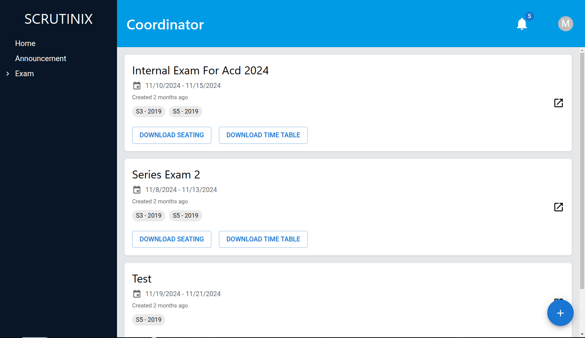
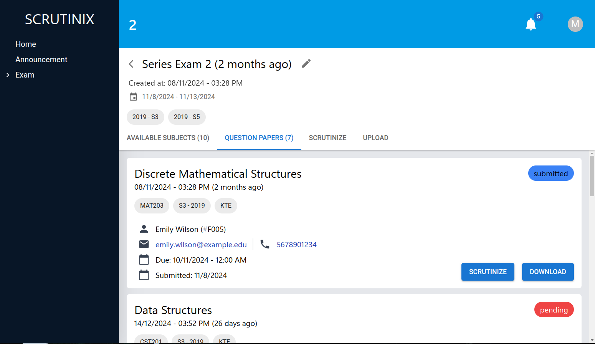
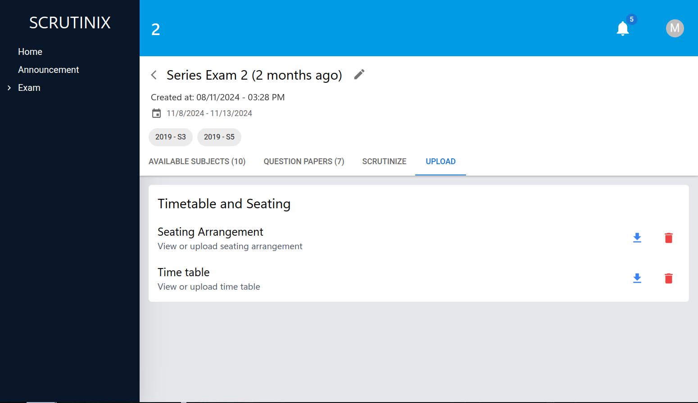
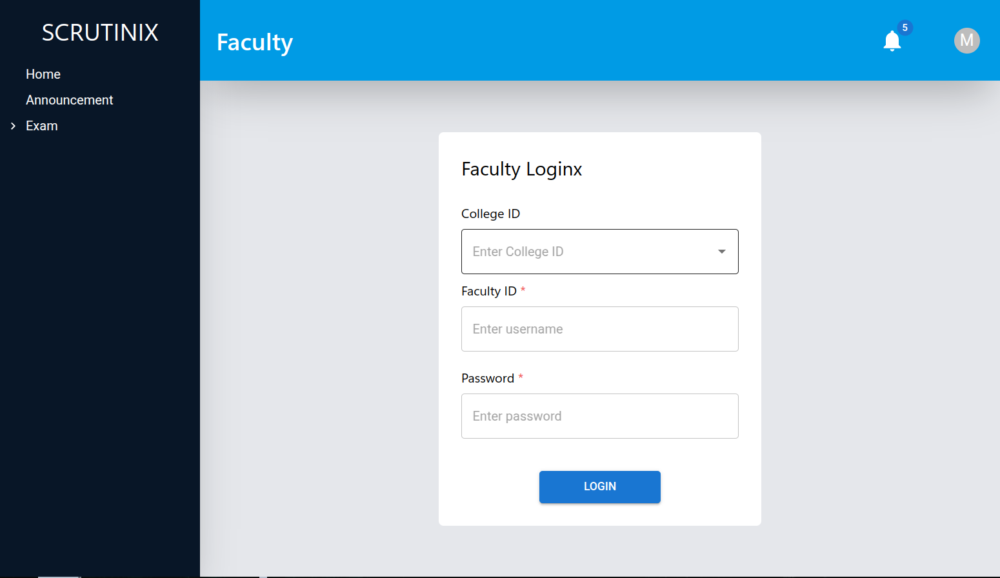

# Scrinix Frontend

The frontend of Scrinix is designed to provide an intuitive and user-friendly interface for exam coordinators and faculty members. 
It facilitates seamless interaction with the backend services, ensuring efficient workflows for exam management and moderation.

> **Note**: The application is not completed. Feel free to contribute or fork this project.

## Backend

See the backend repo [here](https://github.com/fbn776/Scrinix-BE)

## Tech Stack

- Nextjs
- Typescript
- Tailwindcss
- MaterialUI

## Screenshots

| **Coordinator Dashboard** | **Exam Overview** | **Exam Question Paper** |
|----------------------------|-------------------|--------------------------|
|  |  |  |

| **Upload Question Paper** | **Login Screen** |
|---------------------------|------------------|
|  |  |

## Usage

## Development

1. Install the dependencies.
   ```bash
    npm install
    # or
    pnpm install
   ```
2. Start the development server.
   ```bash
   npm run dev
   # or
   yarn dev
   # or
   pnpm dev
   # or
   bun dev
   ```

Open [http://localhost:3000](http://localhost:3000) with your browser to see the result.

